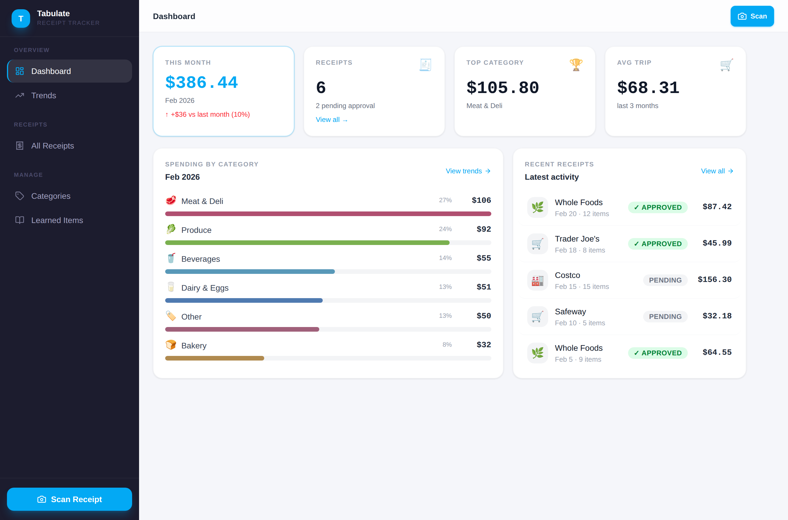
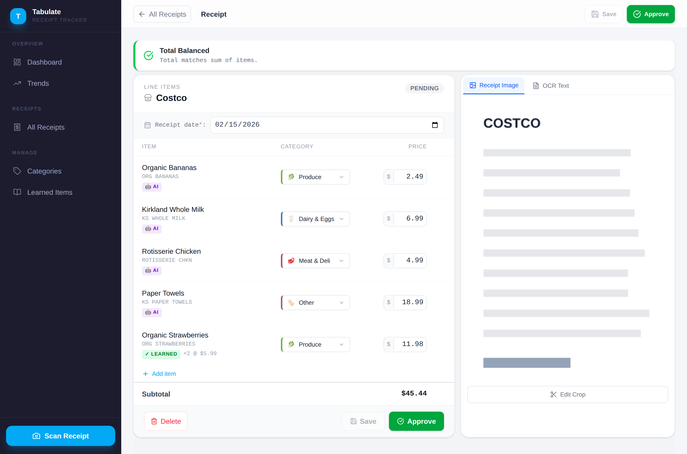
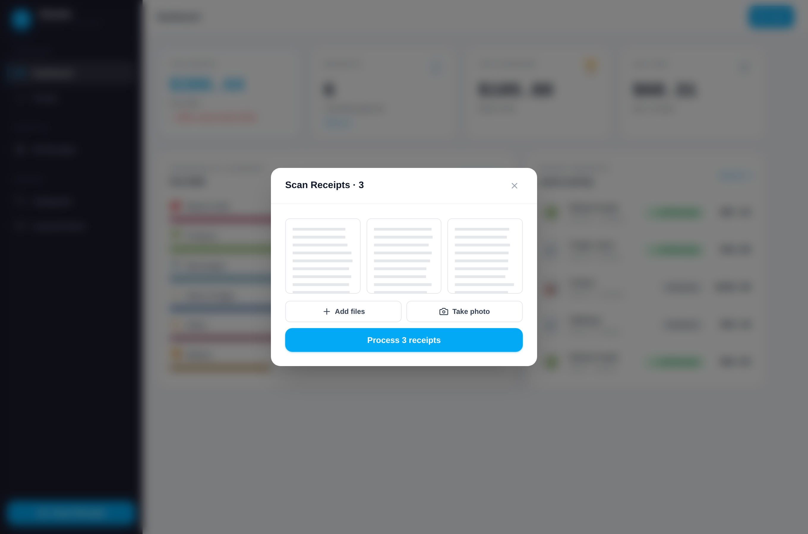
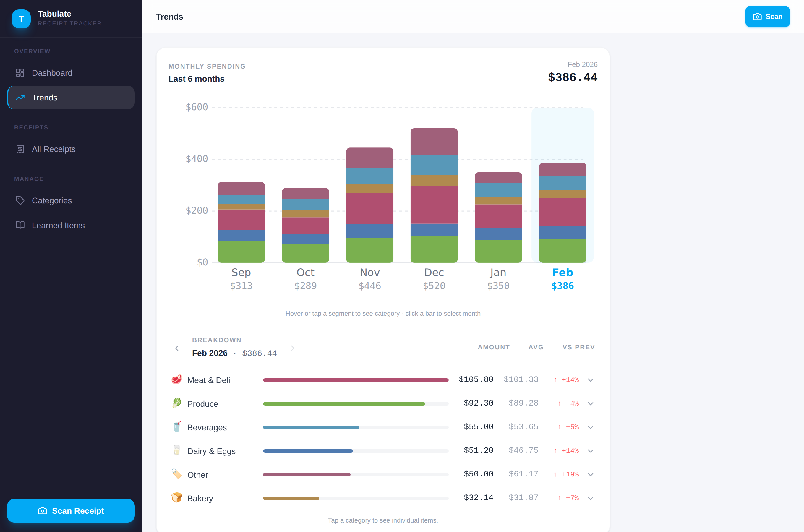
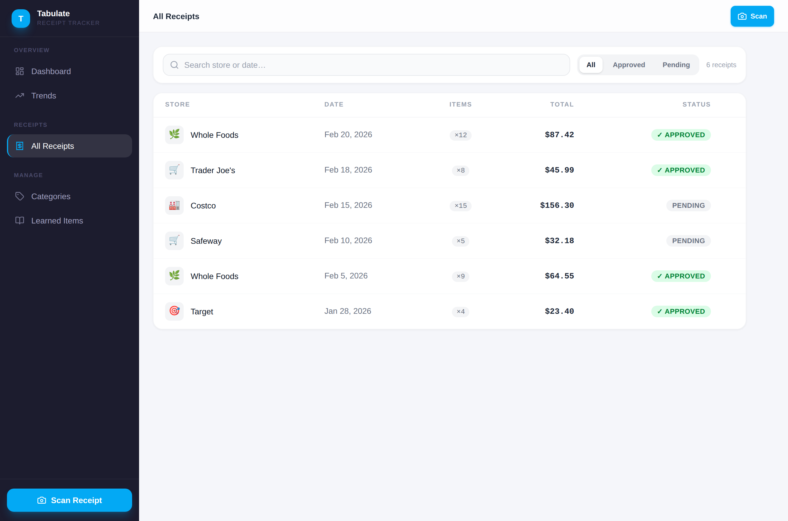

# Tabulate — Receipt Tracker

Self-hosted grocery receipt tracker. Scan receipts with your phone or browser, let OCR + Claude Vision extract items and categories, then review and verify your spending.



## Stack

| Layer | Technology |
|---|---|
| Frontend | React 19 + TypeScript + Vite + Tailwind CSS 4 |
| Backend | FastAPI + Python 3.12 + SQLite (aiosqlite) |
| OCR | Tesseract + Claude Vision (claude-haiku-4-5) |
| State | TanStack Query v5 |
| Container | Docker Compose — nginx (frontend) + uvicorn (backend) |

## Features

- **Upload one or many** — drag-and-drop, multi-select, or snap photos in succession; JPG/PNG/PDF
- **On-device scanning** — automatic paper-edge detection and perspective correction run right in your browser (OpenCV.js + jscanify), so OCR gets a clean, deskewed image — no native app required
- **Review queue** — process a batch of receipts in parallel, then approve them one after another
- **OCR + AI parsing** — Tesseract extracts text; Claude Vision enriches store name, date, and line items
- **Review & verify** — correct categories and prices before saving; total verification check
- **Learned items** — corrections are remembered and applied automatically on future scans
- **Trends** — stacked bar chart of monthly spending by category with month-over-month deltas
- **Categories** — built-in and custom categories with icons, colors, enable/disable

## Screenshots

| Review & verify | Multi-upload |
|---|---|
|  |  |

| Spending trends | All receipts |
|---|---|
|  |  |

## Quick Start

### Prerequisites
- Docker + Docker Compose
- An [Anthropic API key](https://console.anthropic.com/)

### Run

```bash
git clone <repo>
cd tabulate

# Copy env file and add your API key
cp .env.example .env
# Edit .env and set ANTHROPIC_API_KEY=sk-ant-...

docker compose up --build
```

Then open **http://localhost**.

### Development (hot reload)

```bash
# Terminal 1 — backend (auto-reloads on Python changes)
docker compose up backend

# Terminal 2 — frontend (Vite HMR)
npm install
npm run dev
# Opens http://localhost:5173, proxies /api → http://localhost:8000
```

## Project Structure

```
tabulate/
├── src/                      # React frontend (Vite + TypeScript)
│   ├── api/                  # Fetch wrappers for each API resource
│   ├── hooks/                # TanStack Query hooks
│   ├── components/           # Shared UI components
│   ├── pages/                # One file per page/route
│   └── types.ts              # Shared TypeScript interfaces
├── backend/                  # FastAPI app
│   ├── routers/              # receipts, categories, items, trends
│   ├── services/             # ocr_service, image_service, categorize_service
│   ├── models/schemas.py     # Pydantic models
│   └── db/database.py        # SQLite schema + seed data
├── docker/
│   ├── Dockerfile.nginx      # Multi-stage: Node build → nginx serve
│   └── nginx.conf            # Proxy /api → backend, SPA fallback
└── docker-compose.yml
```

## Environment Variables

See [`.env.example`](.env.example) for a template you can copy.

| Variable | Required | Description |
|---|---|---|
| `ANTHROPIC_API_KEY` | Yes | API key for Claude Vision categorization |
| `YNAB_API_TOKEN` | No | YNAB Personal Access Token — enables syncing approved receipts to YNAB. Leave unset to disable the integration. |
| `LOG_LEVEL` | No | Log verbosity: `DEBUG`/`INFO`/`WARNING`/`ERROR` (default: `INFO`) |
| `CORS_ORIGINS` | No | Comma-separated allowed CORS origins (default: `*`) |
| `DB_PATH` | No | SQLite path (default: `/data/tabulate.db`) |
| `IMAGE_DIR` | No | Image storage path (default: `/data/images`) |

## Data Persistence

Receipt images and the SQLite database are stored in a Docker named volume (`tabulate-data`). Data survives container restarts and rebuilds.

```bash
# Backup
docker run --rm -v tabulate_tabulate-data:/data -v $(pwd):/backup \
  alpine tar czf /backup/tabulate-backup.tar.gz /data

# Restore
docker run --rm -v tabulate_tabulate-data:/data -v $(pwd):/backup \
  alpine tar xzf /backup/tabulate-backup.tar.gz -C /
```
